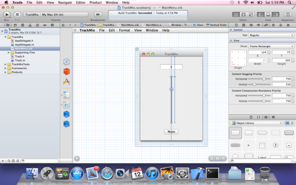
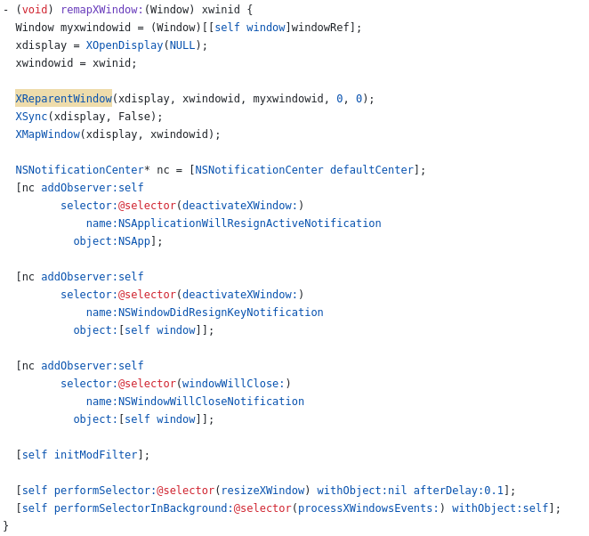

# GNUstep Improvement Notes

## About

This repo is a collection of my notes on improvements and fixes to various parts of
GNUstep which can be made. It is not a progress log or a promise to actually do any
of the things here listed, merely a collection of observations.

## General Observations

- GNUstep has a **really** well designed API, and supports almost all the view and control
  classes one might need to generate any given application interface. However, the
  existing GUI applications give a false impression of the state of what is and is not
  supported -- both Gorm and ProjectCenter's interfaces are rudimentary, far below what
  the GNUstep libraries are capable of.

- I *really* doubt a modern UI skin can be applied to GNUStep that *won't* break every
  existing application's UI layout somehow. Pretty much everything will need to be fixed 
  for it. For Gorm-based interfaces, that's easy.

- We should not simply clone macOS's exact interface theme -- merely be familiar enough
  to users of it, while having an identity of its own.

- Pretty much every GNUStep application is in need of a UI overhaul anyway, and there aren't
  that many of them, so it's probably not *worth* trying to make the new theme not break apps
  designed for the "default" OPENSTEP look.

- Same for menus: pretty much every application's menus need going over, reorganizing,
  bringing into HIG compliance.

- Oh yeah, a Human Interface Guidelines document needs to be written up.

## Installation

- FreeBSD apparently has an easy image builder for making custom respins. Very cool.

- Three things are needed for a Mac-style graphical installer:'

    1. A terminal app

    2. A Disk Utlity type app

    3. An Installer type "wizard" app.

- The first already exists. The second is actually much harder than the first. Outside my
  area, to be sure.

- An "installer" image is basically the same as a "live" image, except instead of the full
  desktop it only exposes stuff needed to install the OS.

- It's not required, at all, but it would be very cool if the result could support G3/G4
  PowerPC systems.

## Applications
- Improve Mail.app with more authentication options, and fix whatever is making it choke on
  my iCloud IMAP mailbox

- Improve Gorm with more support for newer NSView subclasses, and a nicer UI for selecting
  them -- also, it would be nice if instead of little indicator dots for "source" and 
  "target" when making a connection, it actually drew a fucking line between them?

- A Gemini client

- A web browser at least at the level of GNOME's "Web" (great naming, very search-friendly
  fuckos!)

- A nicer IRC client (Maybe a port of https://github.com/psychs/limechat)

- Better file manager (Finder clone?)

- A better programmer's text editor (maybe re-port VSCode's Mac port to GNUStep?) to replace
  the integrated one in Project Center, which barely works (the editing part I mean). PC is
  still find for organizing and controlling the build, most of the time.

- More system preferences panes!

- A better Terminal.app (I may yet work on that one myself)

## GWorkspace

- Factor out the following from GWorkspace into separate apps:

  - Finder (the find file dialog), file inspectors, File Viewer, Desktop Icons -> File Manager
  
  - Remove whatever the fuck "Fiend" is along with the "tabbed shelf"
  
  - Dock and "recycler" -> Dock

- Add the following to GWorkspace:

  - An always-visible "under-menu" stacked always below non-root windows, which displays
    the system menu on the left (Apple menu equivalent) and Menubar Extras (NSStatusBar)
    on the right. Perhaps use NSDistributedNotificationCenter to connect the application 
    controlling a menubar extra and the Workspace process? Or perhaps allow each process 
    to create its own NSStatusBar, and embed them in a horizontal row view in the top bar?

- Modify libs-gui as follows:

  - An app's main menu gets displayed, with no window decorations, horizontally, over the 
    GWorkspace under-menu, positioned and sized such that it does not cover the system 
    menu or menubar extras.

- The GWorkspace built-in Dock works fine overall, but the dock tile for a given app     
  should "swallow" the application icon it would ordinarily hand to Window Maker.

  - Explanation: The application delegate has a method `applicationDockMenu:` which  
    returns an NSMenu instance meant to be shown when the Dock tile for that application 
    is right-clicked. This functionality currently *works*, but the menu is shown by the 
    "app icon" window, which GNUStep currently gives to Window Maker to display in its 
    Dock if the `UseWindowMakerIcons` default is set. 

  - So the behavioural change is to set `UseWindowMakerIcons` to "NO", and somehow have 
    the application tell the Dock which window to swallow.

  - NSApp.iconWindow is the NSWindow which displays the dock icon for the app. So getting 
    the X11 window id for that is as simple as calling NSApp.iconWindow.windowRef to get 
    the ID; then it just needs to be sent to the Dock somehow. This will require 
    investigating the Dock code some more --- clearly the application is broadcasting some info, so maybe that can use used here...

## File Management

- Assume the target underlying OS is FreeBSD with ZFS

- Assume that ZFS will be configured with extended attributes enabled

- Take all the stuff Finder would stick in .DS_Store or the like, and store it in
  extended attributes instead.

## Dock

- The GWorkspace Dock works fine overall, it just needs some tweaks

- Nothing should move unless it is told to move by the user.

- Vertical space is more valuable than horizontal space on a modern widescreen monitor,
  so the Dock should be on the left or right side only. One of the vanishingly few
  things GNOME gets more right than macOS does.
    
- Apps need to do better supporting Dock menus, the menus that appear when you right-click 
  the Dock icon of the app while it's running.

- It should be very obvious whether or not an app pinned to the dock is running. A little 
  indicator dot isn't good enough. Maybe some type of colour-blind friendly glow effect to
  highlight running apps?

Gorm:

- The inspector for NSComboBox is rudimentary. The option to add items to it is there, 
  but doesn't work.

- Adding an NSMenu instance to the nib seems to not ever actually show the new menu to edit it.

- The view selector palette is maddeningly badly designed. It should more like the view
  palette in Xcode (pictured below), which used to be Interface Builder, which is what Gorm
  is cloning anyway.

  

Terminal.app

- When the app becomes active, if there is no terminal window (hidden or not), then one should
  be created and presented to the user automatically. This behaviour can be added to the
  application's delegate, with the method `- (void) applicationDidBecomeActive: (NSNotification *) notification`. 

- The implementation is essentially the same as the action sent by the main menu entry that
  opens a new terminal window, sent to the first responder.

- This task is done now. It took me about 15 minutes to fix this, and I'm not that great
  a programmer.

## Project Center

- To enable Automatic Reference Counting (ARC) in GNUStep builds **by default**, add to your to your `~/.profile` the following line:

```
        export GS_WITH_ARC=1
```

## XEmbed
- We require a class to embed an X11 window into an NSView subclass. Call it XEmbeddedView.

- The actual code used to embed another X11 window (once you have the window ID) inside
  an XEmbeddedView is relatively simple -- basically a wrapper around the same function a
  window manager uses to reparent windows. Essentially, the XEmbeddedView makes the X11 
  window that draws it the parent to the embedded X11 window. So all you need is the X11
  id of the window in question. An alternative approach if one were using something like
  CEF is to use XCreateWindow to directly create a child window of the view, and pass that
  to cef_browser_host_create_browser(). 
  
  